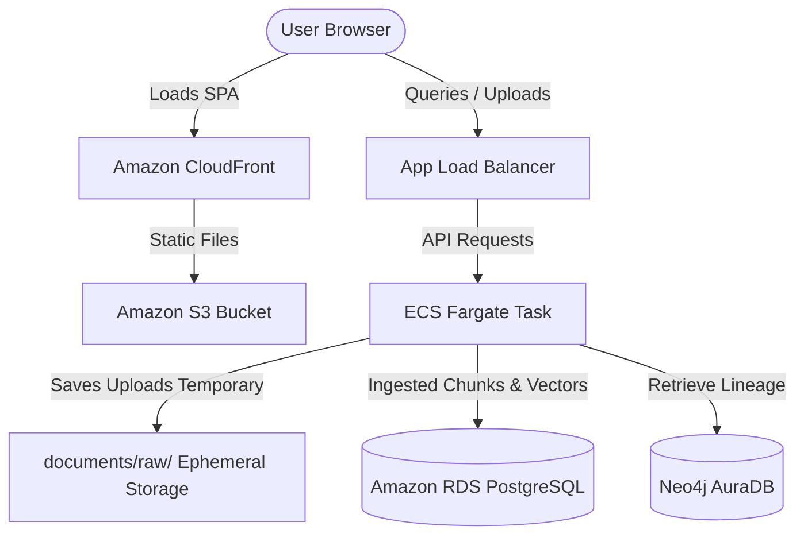

# AWS Billing and Usage Reference Guide

This document provides guidelines and standard operating procedures for monitoring cloud costs, verifying storage architectures, and implementing cost optimization strategies for the `permit_rag` application stack.

---

## 1. AWS Billing & Cost Tracking

### Resolving Billing Access Denied Errors
By default, IAM users (even those with administrative policies like `AdministratorAccess`) cannot view billing details or query cost APIs unless billing access is explicitly enabled for IAM at the account level.

If you see this error:
```
aws: [ERROR]: An error occurred (AccessDeniedException) when calling the GetCostAndUsage operation: User not enabled for cost explorer access
```

Follow these steps to resolve it:
1. Log in to the AWS Console using the **Root User** credentials (the email address used to create the AWS account).
2. Click your account/username in the top-right menu and choose **Account**.
3. Scroll down to the **IAM User and Role Access to Billing Information** section.
4. Click **Edit**, check the box to **Activate IAM Access**, and click **Update**.
5. Navigate to the [AWS Cost Explorer Console](https://console.aws.amazon.com/costmanagement/home) and click **Enable Cost Explorer** or **Launch Cost Explorer**.
   > [!NOTE]
   > It can take up to 24 hours after enabling Cost Explorer for AWS to aggregate and display historical usage data.

---

### Command Line Spend Verification
Once Cost Explorer is active, you can use the AWS CLI to query your monthly spending.

#### Retrieve Current Month-to-Date Cost (Unblended)
```powershell
aws ce get-cost-and-usage `
  --time-period Start=2026-06-01,End=2026-07-01 `
  --granularity MONTHLY `
  --metrics "UnblendedCost"
```

#### Group Costs by Service
To see exactly which cloud resource is consuming your budget:
```powershell
aws ce get-cost-and-usage `
  --time-period Start=2026-06-01,End=2026-07-01 `
  --granularity MONTHLY `
  --metrics "UnblendedCost" `
  --group-by Type=DIMENSION,Key=SERVICE
```

#### Console Billing Dashboard
For a visual overview of invoices, credit usage, and payment history, log in and visit the [AWS Billing and Cost Management Dashboard](https://console.aws.amazon.com/billing/home).

---

## 2. File & Asset Storage Architecture

The `permit_rag` application stores data across different tiers of the AWS cloud based on persistence and serving needs:



| Asset Category | Target Storage Tier | AWS Service | Storage Path / Details |
| :--- | :--- | :--- | :--- |
| **Frontend SPA Assets** | Static Web Hosting | **Amazon S3** | `s3://<frontend_bucket_name>/` (Distributed via CloudFront CDN using Origin Access Control) |
| **Backend Container** | Docker Registry | **Amazon ECR** | `<aws_account_id>.dkr.ecr.<region>.amazonaws.com/permit-rag-backend` |
| **User Uploads (Raw PDFs/HTML)** | Ephemeral Server Storage | **AWS ECS Fargate** | Ephemeral file mount at `documents/raw/` inside the running container (purged on task recycle) |
| **Compliance Text & Vectors** | Relational Database | **Amazon RDS** | Stored in PostgreSQL `documents` and `document_chunks` tables with `pgvector` index |
| **Observability & Linage** | Managed Graph Layer | **Neo4j AuraDB** | Hosted on external AuraDB tier; synced via Bolt protocol |

---

## 3. Cost Containment & Optimization Recommendations

To prevent unexpected charges on a personal or student AWS account during development and testing, adhere to the following recommendations:

### 1. ECS Fargate Sizing (Compute)
Containerized tasks do not require massive servers for dev workloads. Ensure your task definition in `terraform/main.tf` is configured with minimal compute limits:
*   **CPU**: `256` (0.25 vCPU)
*   **Memory**: `512` (0.5 GB)
*   *Avoid allocating 1.0+ vCPU or 2.0+ GB unless running production-scale ingestion pipelines.*

### 2. RDS DB Instance Sizing (Database)
Keep the database tier light during prototyping:
*   Use a burstable instance type: `db.t4g.micro` or `db.t4g.small`.
*   Ensure **Storage Autoscaling** is disabled or capped to prevent runaway disk allocations.
*   Make sure **Multi-AZ Deployment** is disabled (keep it Single-AZ for development).

### 3. S3 Bucket Lifecycle Rules
If raw user uploads are eventually moved to S3 (instead of remaining on local container storage), configure an S3 Lifecycle Policy to automatically expire or archive files:
*   Transition raw uploads to **S3 Standard-IA** (Infrequent Access) after 30 days.
*   Auto-delete or transition to **S3 Glacier Flexible Retrieval** after 90 days.

### 4. API Shielding via AWS WAF
To protect your Anthropic Claude API credits from abuse or automated scraping tools on the `/query/answer` endpoint:
*   Deploy **AWS WAF** (Web Application Firewall) associated with your CloudFront distribution.
*   Enforce a **rate limit** rule (e.g., maximum `300` requests per rolling 5 minutes per IP address) to block API abusers.

### 5. Automated Shut Down / Teardown
If the development environment is inactive for several days (e.g., over school holidays):
*   Tear down the temporary cloud resources with the root-level scripts or Terraform commands:
    ```powershell
    terraform -chdir=terraform destroy
    ```
*   You can redeploy the stack at any time in under 10 minutes using:
    ```powershell
    npm run deploy
    ```

---

## 4. Troubleshooting Gateway Timeouts (504)

### Model Pre-Caching Issue
If a user submits a query to the API and gets a `504 Gateway time-out` from Cloudflare, it is typically caused by model initialization delays:
*   **Symptom**: Cloudflare returns an HTML gateway timeout page, and logs inside ECS Fargate show `Loading NLI classifier: cross-encoder/nli-deberta-v3-small (first use — may download model)`.
*   **Root Cause**: The zero-shot classification model (`cross-encoder/nli-deberta-v3-small`) was previously downloaded dynamically from Hugging Face Hub on first use. On a resource-constrained development Fargate instance (0.25 vCPU), downloading and compiling this model can exceed the 60-second Load Balancer / Cloudflare timeout limit.
*   **Resolution**: The `Dockerfile` has been updated to pre-cache the NLI model during the container build process, alongside the `nomic-embed-text-v1.5` model.
*   **To Deploy the Fix**: Rebuild and push the updated backend container using:
    ```powershell
    npm run deploy:backend
    ```
