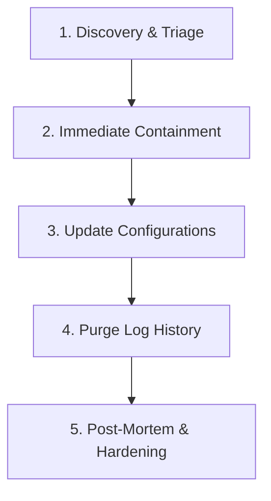

# Incident Response Protocol: Secrets Leak in Cloud Logs

This protocol defines the standard operating procedure (SOP) for containing, mitigating, and documenting incidents where credentials, API keys, or raw passwords are leaked into application logs (e.g., AWS CloudWatch).

---

## Incident Workflow Overview



---

## Step 1: Discovery & Triage
As soon as a secret (password, API key, JWT token, etc.) is identified in plain text within cloud logs:
1. **Identify the affected secret**: Determine which system is compromised (e.g., Neo4j AuraDB, RDS Postgres, Anthropic API, JWT Secret).
2. **Determine the scope**: Identify which log streams, environments (dev/prod), and timeframes contain the plain-text secret.
3. **Notify stakeholders**: Inform the development team and administrators that a credential rotation is underway.

---

## Step 2: Immediate Containment (Credential Rotation)
Do not attempt to delete the logs first. **Always invalidate the secret immediately at the source.**

### A. Rotate Neo4j AuraDB Password
1. Log in to the [Neo4j Aura Console](https://console.neo4j.io/).
2. Select your active database instance.
3. Navigate to the **Settings / Credentials** tab.
4. Click **Reset Password** to generate a new administrative password.
5. Copy the newly generated password.

### B. Rotate Other Common Stack Credentials
* **AWS RDS Postgres**: Update the master password using Terraform or the AWS RDS Console.
* **Anthropic API Key**: Revoke the compromised key in the Anthropic Developer Console and generate a new one.

---

## Step 3: Update Configurations
Update the production secrets storage layer so the application containers spin up with the new credentials.

1. Open the **AWS Systems Manager (SSM) Parameter Store** in the AWS Console.
2. Select the affected parameter:
   * `/permit_rag/prod/neo4j_auth`
   * `/permit_rag/prod/anthropic_api_key`
3. Click **Edit**, input the new value (ensuring correct formatting, e.g., `neo4j/<new-password>`), and click **Save Changes**.
4. Trigger a rolling redeployment of your ECS service to pick up the new secrets:
   ```powershell
   aws ecs update-service --cluster permit-rag-cluster --service permit-rag-service --force-new-deployment
   ```

---

## Step 4: Purge Log History from CloudWatch
Once the old credential is deactivated and the new credential is in use, delete the historical logs to prevent unauthorized access.

### Option A: Recreate the Log Group (Fastest & Simplest for Dev)
If you can afford to lose recent non-security log history in your dev environment:
1. Delete the log group via the AWS CLI:
   ```powershell
   aws logs delete-log-group --log-group-name /ecs/permit-rag-backend
   ```
2. Recreate the log group:
   ```powershell
   aws logs create-log-group --log-group-name /ecs/permit-rag-backend
   ```
   *(Note: The ECS tasks will automatically resume logging to this group).*

### Option B: Delete Specific Log Streams (Preserves Other Streams)
If you want to keep other log history:
1. Find the specific log stream name containing the leak (e.g., `backend/backend/72c42ecd3fca443e835bd58fe022bdc1`).
2. Delete that stream:
   ```powershell
   aws logs delete-log-stream --log-group-name /ecs/permit-rag-backend --log-stream-name <stream-name>
   ```

---

## Step 5: Post-Mortem & Hardening

> [!IMPORTANT]
> Never close a security incident until the code vulnerability that led to the leak is fixed.

1. **Conduct Code Sanitization**:
   * Inspect the exception throwing code. Ensure that raw parameter values are never interpolated into log/error strings.
   * Wrap configuration parsing errors in clean generic exception messages.
2. **Implement Masking Filters**:
   * If possible, configure log formatters (like Python's `logging` filters) to replace patterns matching passwords or keys with `[REDACTED]`.
3. **Document the Incident**:
   * Record the date, compromised secret, cause of the leak, and date of resolution in your project's security logs.
