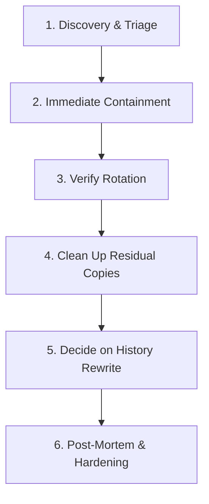

# Incident Response Protocol: Secrets Leak

Standard operating procedure for containing, mitigating, and documenting incidents where credentials, API keys, or raw passwords are exposed in this repo's actual leak surfaces — **git history / GitHub**, and secondarily AWS logs — for this stack specifically (Terraform-managed AWS: RDS Postgres via SSM Parameter Store, ECS Fargate). Worked example throughout: the 2026-08 incident where `scripts/reprocess_corpus.sh`/`.ps1` logged its own invocation args (including the full prod RDS connection string) into a tracked report file, committed in `a53f476`/`ca81c3e`, already pushed to `origin/deployment/sites`.

---

## Incident Workflow Overview


```mermaid
graph TD
    A[1. Discovery & Triage] --> B[2. Immediate Containment]
    B --> C[3. Verify Rotation]
    C --> D[4. Clean Up Residual Copies]
    D --> E[5. Decide on History Rewrite]
    E --> F[6. Post-Mortem & Hardening]
```

---

## Step 1: Discovery & Triage

1. **Identify the affected secret and where it's exposed.** For a git-history leak, search all branches, not just HEAD:
   ```bash
   git log --all --oneline -- '<suspect-path-glob>'
   git log --all -p -- <path> | grep -iE 'password|DATABASE_URL|postgres://'
   ```
   Confirm which commits are reachable and on which branches/remotes (`git log --all --source`) — a file deleted from HEAD is **not** removed from history; the commit that added it is still fully reachable unless history is rewritten (Step 5).
2. **Determine the scope.** Which secret, which environment (dev/prod), how long it's been exposed, and whether it's already reachable on `origin/*` (pushed = assume compromised, not just "at risk").
3. **Notify stakeholders.** For a one-person/small-team project, this is a synchronous "raise it now" — don't sit on a live prod credential exposure while deciding priority.

---

## Step 2: Immediate Containment (Credential Rotation)

**Do not attempt to scrub git history first.** Always invalidate the secret at its source before anything else — a rewritten history doesn't help if the old value still authenticates.

### RDS Postgres password (this stack's actual credential shape)

The master password is Terraform-managed via an SSM `data` source (`terraform/main.tf:197-198`, `/permit_rag/prod/db_password`), read into **both** `aws_db_instance.postgres.password` (main.tf:220) **and** plaintext-interpolated into `DATABASE_URL`/`CORPUS_WRITER_URL`/`APP_READER_URL` in the ECS task definition (main.tf:361-363, `value` not `valueFrom`). Rotating correctly means updating the SSM value *and* letting Terraform propagate it to both places in one `apply` — not a bare `aws rds modify-db-instance`, which would desync RDS from the ECS task's plaintext connection strings and break the live app.

1. Generate a new password (AWS-native, avoids punctuation that breaks URL embedding):
   ```bash
   aws secretsmanager get-random-password --password-length 24 --exclude-punctuation --region us-east-1 --output text --query RandomPassword
   ```
2. **Pin the region and confirm the account explicitly** — this is the single biggest failure mode in practice. SSM parameter names are unique per account+region; writing without an explicit `--region` can silently create a *new, unrelated* parameter of the same name in whatever region your CLI defaults to, leaving the real one (and the live credential) untouched while `terraform plan` reports "no changes" against the parameter it actually reads:
   ```bash
   aws sts get-caller-identity   # confirm Account matches the target (check terraform/main.tf's provider block / known account id)
   aws ssm put-parameter --name "/permit_rag/prod/db_password" --value "<new-password>" --type SecureString --overwrite --region us-east-1
   aws ssm get-parameter --name "/permit_rag/prod/db_password" --with-decryption --region us-east-1 --query Parameter.Value --output text   # confirm it actually took
   ```
3. Apply via Terraform, from the machine holding the real local state (this repo has **no remote backend** — state is local-only, so this must be the one machine that has actually run `apply` before; see `docs/env_secrets_strategy.md` and Step 4 below):
   ```bash
   cd terraform
   terraform plan    # expect a real diff: aws_db_instance.postgres + aws_ecs_task_definition.backend (replacement) + output db_password
   terraform apply
   ```
4. Confirm the ECS service picked up the new task definition revision:
   ```bash
   aws ecs describe-services --cluster permit-rag-cluster --service permit-rag-service --query 'services[0].deployments'
   ```

### Other secrets already SSM-backed (`valueFrom`, not plaintext)

`ANTHROPIC_API_KEY`, `API_ADMIN_TOKEN`, `LANGSMITH_API_KEY`, and the Neo4j/other provider keys are wired as real `valueFrom` SSM references (`terraform/main.tf:389,413,417` etc.) — rotating these is a straight `put-parameter --overwrite` on the relevant `/permit_rag/prod/<name>` path followed by `terraform apply` (or `aws ecs update-service --force-new-deployment` if no other Terraform diff is pending), no RDS-specific propagation concern.

---

## Step 3: Verify Rotation — Don't Trust SSM/Terraform Output Alone

SSM parameter state and `terraform plan` output are statements of *intent*; they don't prove what the live resource actually accepts. Confirm against the real endpoint directly:

```bash
# Old/leaked password — must now fail with an auth error, not a timeout
psql "postgresql://postgres:<OLD_PASSWORD>@<rds_endpoint>/permit_rag?sslmode=require" -c "select 1;"

# New password — must succeed
psql "postgresql://postgres:<NEW_PASSWORD>@<rds_endpoint>/permit_rag?sslmode=require" -c "select 1;"
```

Notes:
- The RDS security group only admits two allowlisted `/32` IPs (`terraform/main.tf`, campus + home) — a connection *timeout* here is a network/allowlist issue, not evidence about the password. Only a `FATAL: password authentication failed` (or a clean successful query) is a real signal. Check your current public IP (`https://checkip.amazonaws.com`) against the security group before reading too much into a failed connection.
- If you need to test from an unlisted location, temporarily add your IP as a fourth `cidr_blocks` entry in the RDS security group (`terraform/main.tf`), test, then remove it and re-apply the same session — don't leave an ad hoc allowlist entry standing after a credential incident is still open.

---

## Step 4: Clean Up Residual Copies

Rotating the live credential does not erase every place the old value is still sitting. Check each of these:

1. **Old ECS task definition revisions.** Since `DATABASE_URL` etc. are plaintext (not `valueFrom`), every previously-registered task definition revision retains its own frozen copy of the old connection string — task definitions are immutable, a new `apply` registers a new revision, it does not edit old ones.
   ```bash
   aws ecs list-task-definitions --family-prefix permit-rag-backend
   aws ecs deregister-task-definition --task-definition permit-rag-backend:<old-revision>
   aws ecs delete-task-definitions --task-definitions permit-rag-backend:<old-revision>   # after deregistering
   ```
2. **Local Terraform state.** No S3/remote backend is configured — `terraform.tfstate` lives as a plaintext file on whichever machine last ran `apply`, and stores the resolved password value for as long as it held the old one. Not committed to git (gitignored), but still a plaintext copy on disk.
3. **CloudWatch Logs**, if the leak path (or this one) involved anything writing the secret to stdout/stderr inside the container (the `awslogs` driver ships to `/ecs/permit-rag-backend`-style log groups):
   ```bash
   aws logs filter-log-events --log-group-name /ecs/permit-rag-backend --filter-pattern "<fragment-of-OLD-password>"
   ```
   If found, delete the specific log stream (`aws logs delete-log-stream`) or the whole group if acceptable to lose (`aws logs delete-log-group` + recreate) — only after the new credential is confirmed live (Step 3), never before.
4. **CloudTrail** — low concern; AWS excludes SSM parameter values from logged request/response bodies. Not worth spending time on unless the above come up clean and you want to be exhaustive.
5. **The tracked file that caused the leak in the first place** — remove it from the current tree and add its directory to `.gitignore` (done for the 2026-08 incident: `evaluation/results/reprocess/` — commit `0264295`). Fix the root cause in the code that wrote it (Step 6), not just the symptom.

---

## Step 5: Decide on Git History Rewrite

Removing a file from HEAD does **not** remove it from history — the commit that introduced it is still fully reachable via `git log --all`, and if it's already pushed, it's already on GitHub regardless of later commits. This is a real, separate decision from rotation, not an automatic next step:

- **If the credential is confirmed rotated and dead** (Step 3 passed), the historical exposure is a hygiene/compliance concern, not an active risk — reasonable to defer as its own deliberate task rather than rush it.
- **If you do rewrite** (`git filter-repo` or BFG Repo-Cleaner), understand this force-pushes and rewrites shared history: anyone else with a local clone needs to re-clone or hard-reset, not just `git pull`. Don't do this as a rushed follow-on to rotation — schedule it deliberately and notify anyone else with a clone first.

---

## Step 6: Post-Mortem & Hardening

> [!IMPORTANT]
> Never close a security incident until the code vulnerability that caused the leak is fixed, not just the resulting file removed.

1. **Fix the root cause in code.** For the 2026-08 incident: `scripts/reprocess_corpus.sh`/`.ps1` logged its own invocation args (including `$DatabaseUrl`) straight into a tracked report — fixed by sanitizing the value before it's written (commit `c4197d9`, `Sanitize-Text $DatabaseUrl`). Generally: audit anywhere a connection string, API key, or token could be interpolated into a log line, error message, or report file, and mask it before it's ever written, not after.
2. **Add masking filters where plausible** — e.g. a `logging.Filter` that redacts patterns matching connection strings/passwords before they hit any sink.
3. **Confirm `.gitignore` coverage** for anything the fix pattern above writes (`evaluation/results/reprocess/`, `evaluation/cache/`, `.env*` — see `docs/env_secrets_strategy.md` for the full current list).
4. **Document the incident**: date, compromised secret, root cause, rotation confirmation method, and whether history was rewritten — in `STATE.md`'s security section and/or a dated journal entry, per this repo's existing convention, not just in this protocol doc.
